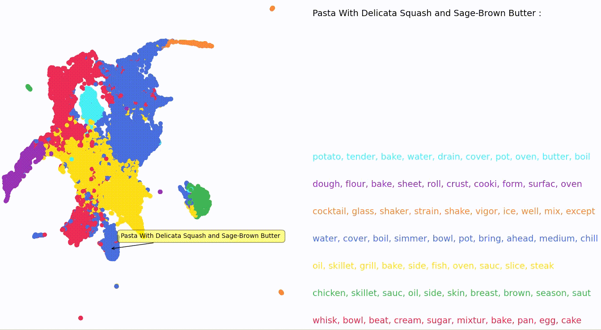

# ITA: Text Analytics
**Lecturer:** Prof. Dr. Michael Gertz

**Term:** Winter Semester 20/21

## Assignments

The assignments 1 to 4 can be found in the respective folders.

## [Project](scr/)

To get started with running the example pipelines [read more here](scr/). Our project implementation is found in the [src folder](scr/) together with a [README](scr/), where all important steps are described.

In our project we are clustering and augmenting recipes. A detailed description of the project idea can be found in the [proposal](proposal/project-proposal.pdf). An overview over the progress and an analysis of the dataset in particular can be found in our report for the [first milestone](milestone-1/README.md). Our issue tracking and meetings are documented in the folder [meetings](meetings/).

### Appetizer
Just to give a taste, here is a clustering visualization using [UMAP](https://umap-learn.readthedocs.io/en/latest/), k-Means clustering and baseline approach (TF-IDF, TruncatedSVD).
