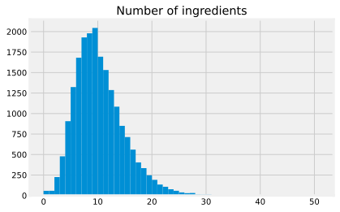
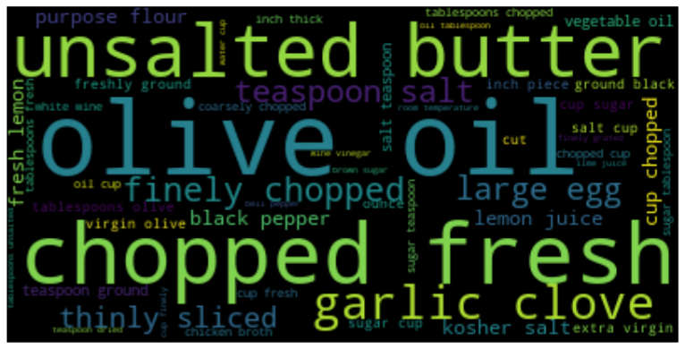
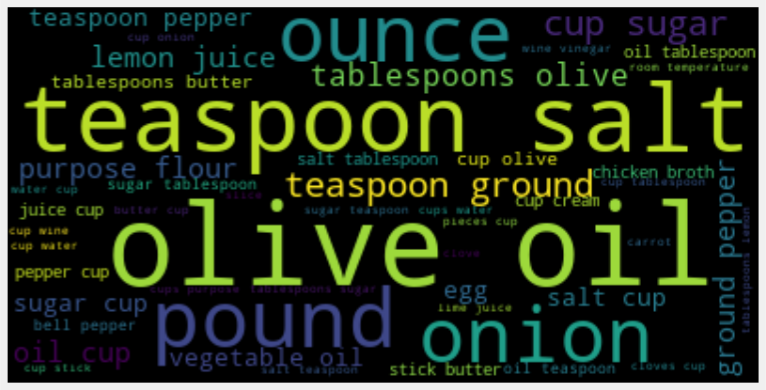
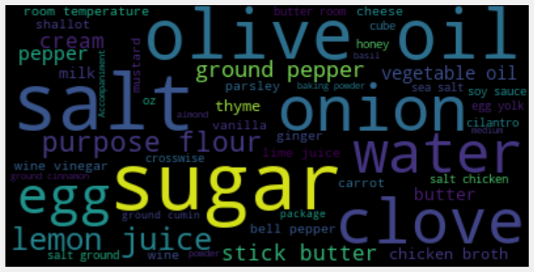
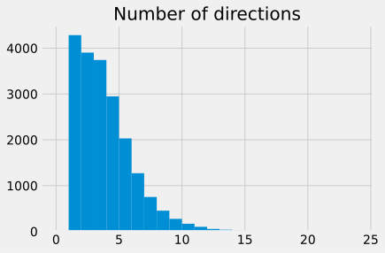
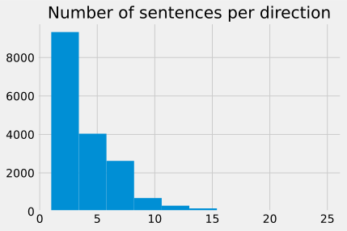
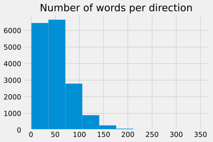
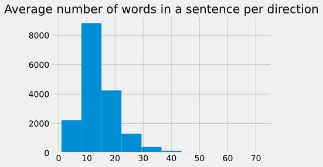
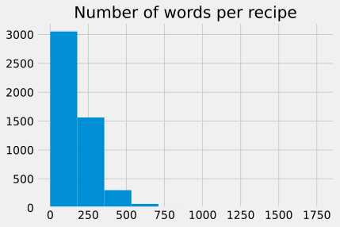

# Epicurious 

## Short Summary

**Number of Recipes:** 20111

**Source:** https://www.kaggle.com/hugodarwood/epirecipes

**Format:** JSON

**Level of Tokenization:** Splitted in recipe and splitted instructions, containing some None values.

### Analysis

The original dataset contained 20130 recipes, some without instructions or ingredients.
 

### Ingredients




    Median number of ingredients: 9.0
    Std. deviation of number of ingredients: 4.60


The median number of ingredients is 9, which seems plausible. There are some recipes that require a lot of ingredients, i.e. the distribution is long tailed. However, the majority has 1-20 ingredients. There are some ingredients that require no ingredients (i.e. those are nan values or empty lists)


    To Toast and Skin Hazelnuts : 2
    To Toast Spices, Nuts, or Seeds : 3
    Barley and Mushroom Pilaf : 0
    Grilling Procedure : 6
    Chicken Tarragon : 2
    Boiling Water Bath for Jams, Chutneys, Pickles, and Salsas : 8
    Asian Lamb Stir-Fry in Radicchio Wraps : 0
    To Prepare a Water Bath for Baking : 1
    Procedure for Shorter Time Processing : 5
    Procedure for Longer Time Processing : 5


As one can see, many recipes with no ingredients are instructions for common task or general cooking skills, like grilling or preparing water baths.





As one can see, olive oil is the most prominent ingredient. However, the ingredients include adjectives (chopped, fresh, unstalted, large etc.). This needs to be cleaned to obtain the real ingredients.





This looks better, but still cup is the most prominent word although it is a measure and not an ingredient. This probably has to be removed manually via a stopword list, tablespoon, teaspoon, pund, similarly. Interestingly words like vegetable are of course nouns but most likely appear in combination with stock for example where they are adjectives. This has to be taken care of. Why are lentils so prominent?





Now the results look as we would expect them. The most prominent ingredient is sugar followed by salt, onlive oil, onion etc.

### Directions





    Median number of directions: 3.0
    Std. deviation of number of directions: 2.34


Interestingly, ther are quite a lot of recipes with only a few directions (i.e. simple recipes). Only a samll number of recipes have more than 10 directions.


    Mixed-Berry Daiquiri : 9
    Barley and Mushroom Pilaf : 0
    Old-Fashioned : 7
    Asian Lamb Stir-Fry in Radicchio Wraps : 0
    Mulled Cider : 8
    Pineapple-Banana Smoothie : 5
    Dragoon Punch : 8
    Plum Glaze : 7
    Plum Glaze : 7
    Frozen Banana, Pineapple and Rum Cocktail : 8


While some recipes with no instructions also have no ingredients, there are some which should have instructions. Interesstingly, most of the recipes are for drinks.











This is varying quite a lot! So there is no clue if the directions are especially long or short. Of course the correlation between #words and #sentences is positive. Interestingly it is more a cloud than a line, so some variation.





There are some recipes which are really long, the majority of recipes has between 1 and 500 words.

## Sample recipe from the dataset 

```
directions: ['Fill 2 Old Fashioned glasses with ice. Divide rye, honey liqueur, and bitters between glasses. Stir for 5 seconds. Top with a splash of ginger ale. Garnish with orange twists.']

fat: nan

date: 2011-08-10 04:00:00+00:00

categories: ['Bitters', 'Liqueur', 'Alcoholic', 'Cocktail Party', "Father's Day", 'Cocktail', 'Rye', 'Bon Appétit', 'Drink']

calories: nan

desc: For inspiration, co-owner Eyal Raziel looked to his native Israel, where honey liqueur is popular. "The Bärenjäger balances the kick of the rye," he says.

protein: nan

rating: 0.0

title: Honey Rye 

ingredients: ['5 tablespoons rye whiskey', '3 tablespoons honey liqueur (such as Bärenjäger)', '1/4 teaspoon orange bitters', 'Ginger ale', '2 orange twists', 'Ingredient info: Honey liqueur is available at well-stocked liquor stores and online from bevmo.com.']

sodium: nan
```

As one can see, there are some columns with nan values.

[Back to README.md](../README.md)