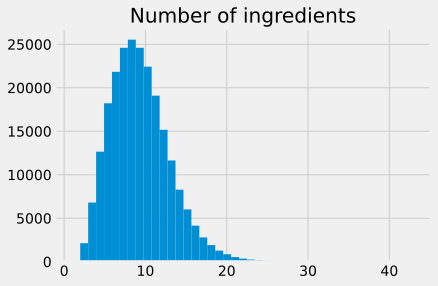
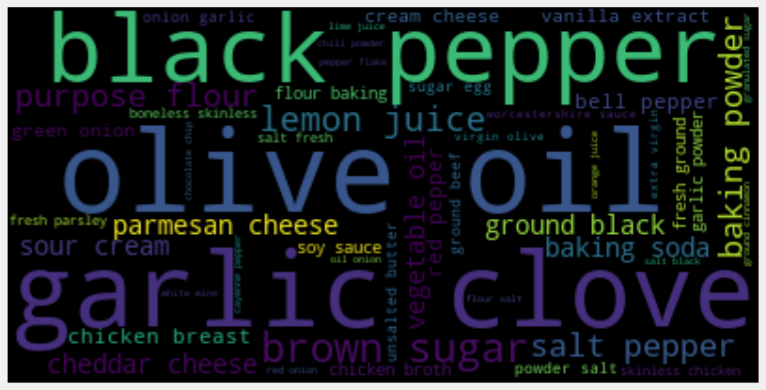
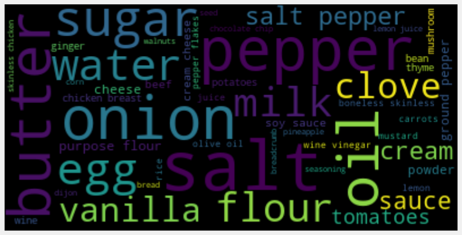
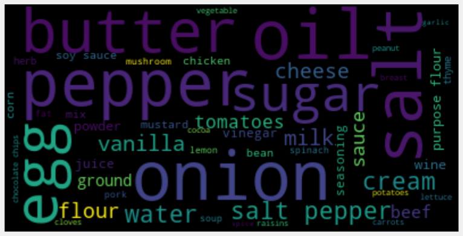
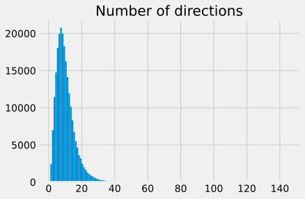
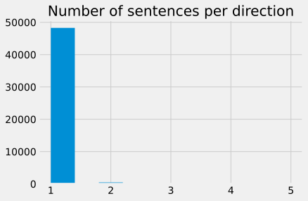
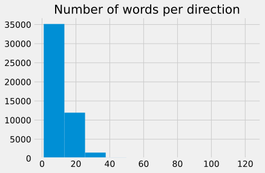
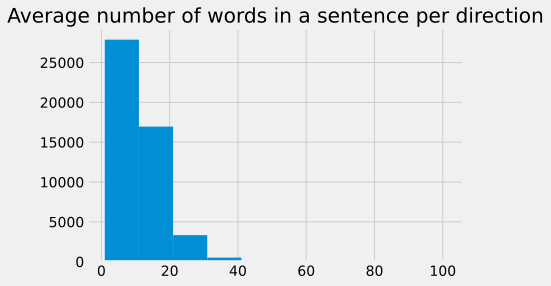
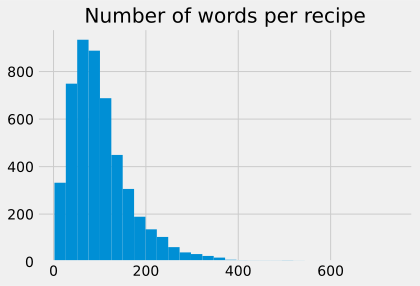

# Food.com with interactions

## Short Summary

**Number of Recipes:** 231636

**Source:** https://www.kaggle.com/shuyangli94/food-com-recipes-and-user-interactions

**Format:** CSV

**Level of Tokenization:** Ingredients and Instructions seperated. Some interaction data.

## Analysis

We  had to remove one recipe.

### Ingredients

    Median number of ingredients: 9.0
    Std. deviation of number of ingredients: 3.73

The median number of ingredients per recipe is 9, which seems plausible. There are some recipes that require a lot of ingredients, i.e. the distribution is long tailed. However, the majority has 1-20 ingredients.

As one can see, no recipes with no ingredients are present here, so the dataset authors likely already did some preprocessing here.

As one can see, olive oil is the most prominent ingredient here.

### Directions

    Median number of directions: 9.0
    Std. deviation of number of directions: 6.00

Some recipies have a lot of instructions (> 100).

For one liners, here are a few example: 
    ['cut all ribs into serving size pieces sprinkle ribs with salt in a dutch oven , brown ribs on all sides in veg oil over medium heat remove ribs from pot saute onions in pot until lightly browned return ribs to pot combine all remaining ingredients in a bowl and mix together- add to pot cover pot and cook over low heat for approx 2 hours , or until tender , stirring occasionally']
    ['mix , sprinkle lightly on your favorite cut of beef , then cook as desired !']
    ['mix all ingredients in blender until smooth']
    ['whisk all ingredients together , bring to boil in medium saucepan , and simmer 45 minutes until thick and reduced to about 1 cup of sauce']
    ['mix together and dip dip dip !']

While some recipes with no instructions also have no ingredients, there are some which should have instructions. Interesstingly, most of the recipes are for drinks.

This is varying quite a lot! So there is no clue if the directions are especially long or short. Of course the correlation between #words and #sentences is positive. Interestingly it is more a cloud than a line, so some variation.

[Back to README.md](../README.md)