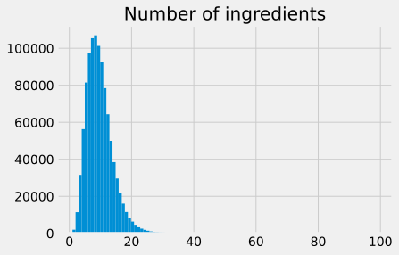
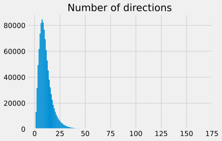

# Recipe1M+
## Short Summary

**Number of Recipes:** 1029720

**Source:** http://pic2recipe.csail.mit.edu/


**Format:** JSON

**Level of Tokenization:** Splitted in instructions and ingredients. Instructions are splitted mainly as sentences.

## Analysis


### Ingredients





    Median number of ingredients: 9.0
    Std. deviation of number of ingredients: 4.31


The median number of ingredients is 9, which seems plausible. However, the majority has 4-15 ingredients.

#### Wordcloud


As one can see, salt is the most prominent ingredient. However, the ingredients include adjectives and some common words(black, clove, teaspoon, chopped etc.). This needs to be cleaned to obtain the real ingredients.


### Directions





    Median number of directions: 9.0
    Std. deviation of number of directions: 6.95


Interestingly, ther are quite a lot of recipes with only a few directions (i.e. simple recipes). Only a samll number of recipes have more than 20 directions.


The instructions seem to be mostly one sentenced, this might have to do with the preprocessing done by the authors.


Some the recipes are short. This might be caused by sorting in the dataset.
#FIXME: RUN over night

### Dataset sources


    


There seems to be more epicurious.com recipes  inside of this dataset (48701) than in the special epicurious recipe.

#### Scraping sources

Here is a wordcloud map with the domain names of the recipes.


## Sample recipe from the dataset 
```
ingredients: ['1 onion, finely chopped', '3 tablespoons oil', '1 cup ketchup', '12 cup water', '12 cup cider vinegar', '2 14 tablespoons sugar', '2 tablespoons Worcestershire sauce', '2 tablespoons honey', '2 teaspoons mustard powder', '2 teaspoons paprika', '1 teaspoon salt', 'pepper', '18 teaspoon hot pepper sauce (can use more if desired)', '1 lemon, sliced (unpeeled)', '3 12 lbs mini smoked link sausage or 3 12 lbs hot dogs']

url: http://www.food.com/recipe/party-dog-appetizers-132426

partition: train

title: Party Dog Appetizers

id: 0002e15d76

directions: ['Grease a 13 x 9-inch baking dish.', 'In a large saucepan, saute the onion in oil until tender (about 3-4 minutes).', 'In a bowl, combine all remaining ingredients including the lemon slices (except the sausages) mix well to combine, and bring to a boil.', 'Reduce heat; simmer uncovered for about 20-25 minutes, or until slightly thickened (stirring occasionally).', 'Remove the lemon slices and discard.', 'Place the sausages or hot dogs in the baking dish.', 'Top with sauce, and mix slightly to combine.', 'Bake in a 350 degrees oven, uncovered for about 20-25 minutes, or until heated through.', 'Keep warm when serving.']
```

As one can see, this dataset mainly includes the essential recipe information. It is partitioned into train, val and test. The ingredient adjectives are separated by commas.

[Back to README.md](../README.md)