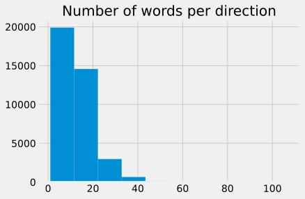

# Recipe1M+ Nutritional
## Short Summary

**Number of Recipes:** 51235

**Source:** http://pic2recipe.csail.mit.edu/

**Format:** JSON

**Level of Tokenization:** Splitted in instructions and ingredients. Instructions are splitted mainly as sentences. Additional information for healthiness and calories are available.

## Analysis
### Ingredients

    Median number of ingredients: 6.0
    Std. deviation of number of ingredients: 2.81

The median number of ingredients is 6, which seems plausible. However, the majority has 1-15 ingredients.

As one can see, salt is the most prominent ingredient. However, the ingredients include adjectives and some common words(without, bottled, fluid, added etc.). This needs to be cleaned to obtain the real ingredients.

### Directions

    Median number of directions: 6.0
    Std. deviation of number of directions: 5.79

Interestingly, ther are quite a lot of recipes with only a few directions (i.e. simple recipes). Only a samll number of recipes have more than 20 directions.

The instructions seem to be mostly one sentenced, this might have to do with the preprocessing done by the authors.

Some the recipes are short.

[Back to README.md](../README.md)