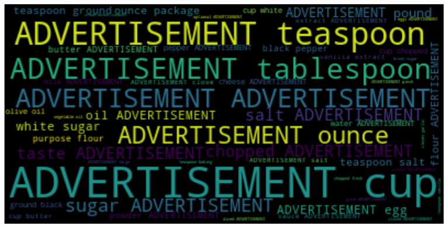

# Recipebox
## Short Summary

**Number of Recipes:** 39522

**Source:** https://eightportions.com/datasets/Recipes/

**Format:** JSON

**Level of Tokenization:** Splitted in Ingredients and Instructions. Meaningful distinction in instructions.

## Analysis

### Ingredients

    Median number of ingredients: 10.0
    Std. deviation of number of ingredients: 3.95

The median number of ingredients is 10, which seems plausible. There are some recipes that require a lot of ingredients, i.e. the distribution is long tailed. However, the majority has 1-16 ingredients. Interestingly there is a gap at 17 in the distribution.

As one can see, advertisement is the most prominent ingredient. This might be because the dataset removed ads and replaced them by the ADVERTISEMENT tag. Next we only consider nouns for the word cloud.

This looks better, but still units are the most prominent words although they are not ingredients. This probably has to be removed manually via a stopword list, tablespoon, teaspoon, pound, similarly. Most importantly however, advertisement needs to be removed.

As one can see, sugar, butter, salt and onion are the most frequent ingredients. Advertisement is still in the cloud, probably because it has a space in front or so. Furthermore, weird things like purpose and package still need to be removed.

### Directions

    Median number of directions: 4.0
    Std. deviation of number of directions: 1.70

Interestingly, ther are quite a lot of recipes with only a few directions (i.e. simple recipes). Only a samll number of recipes have more than 10 directions.

This is varying quite a lot! So there is no clue if the directions are especially long or short. Of course the correlation between #words and #sentences is positive. Interestingly it is more a cloud than a line, so some variation.

[Back to README.md](../README.md)