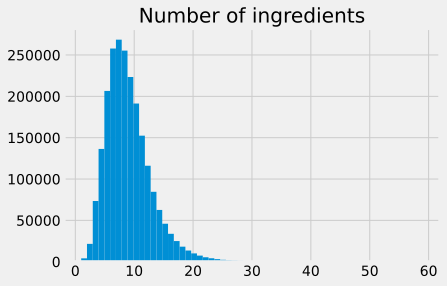
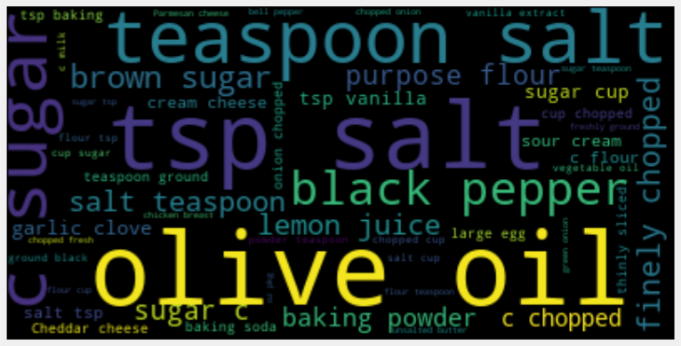
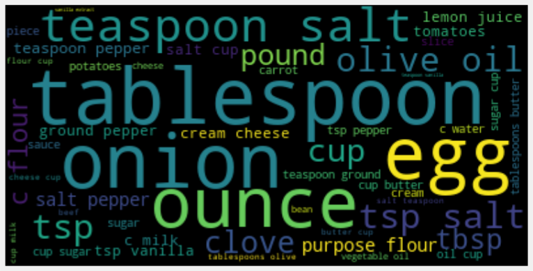
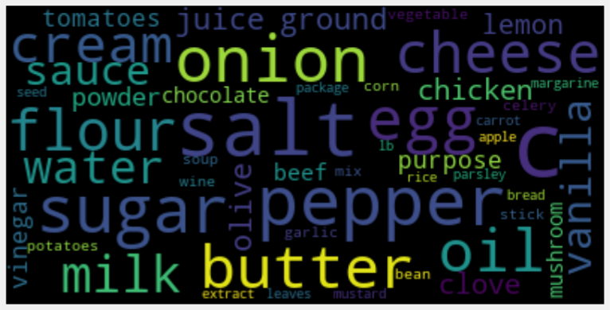
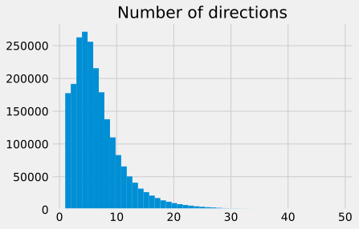
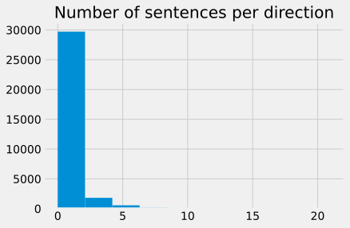
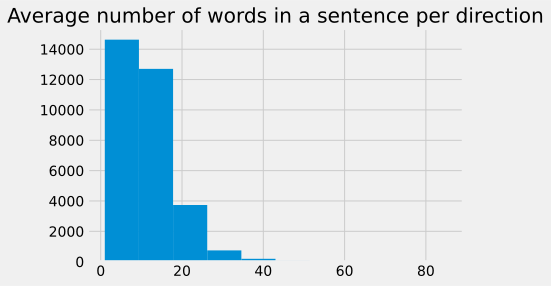
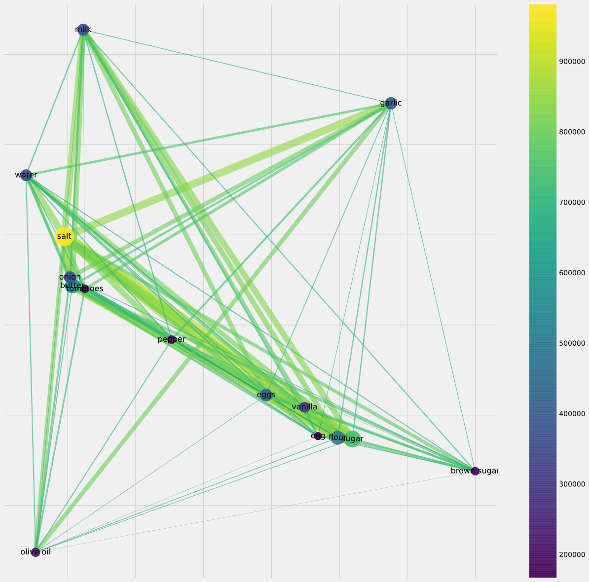

# RecipeNLG
## Short Summary

**Number of Recipes:** 2231142

**Source:** 
https://github.com/Glorf/recipenlg


**Format:** CSV

**Level of Tokenization:** Ingredients and instructions seperated. Namedentityrecognition available.

Contains the Recipe1M dataset.
## Analysis


### Ingredients




    Median number of ingredients: 8.0
    Std. deviation of number of ingredients: 4.00


The median number of ingredients is 8, which seems plausible. There are some recipes that require a lot of ingredients, i.e. the distribution is long tailed. However, the majority has 1-22 ingredients. There are no recipes that require no ingredients since they would have been dropped above.





As one can see, sugar is the most prominent ingredient. However, the ingredients include adjectives and measures (chopped, c (cup), tsp (teaspoon), oz, etc.). This needs to be cleaned to obtain the real ingredients.




This looks better, but still cup is the most prominent word although it is a measure and not an ingredient. This probably has to be removed manually via a stopword list, tablespoon, teaspoon, pund, similarly. Interestingly words like vegetable are of course nouns but most likely appear in combination with stock for example where they are adjectives. This has to be taken care of. Why are lentils so prominent?





### Directions





    Median number of directions: 5.0
    Std. deviation of number of directions: 5.13


Interestingly, ther are quite a lot of recipes with only a few directions (i.e. simple recipes). Only a samll number of recipes have more than 10 directions.


    ['In a slow cooker, combine all ingredients. Cover and cook on low for 4 hours or until heated through and cheese is melted. Stir well before serving. Yields 6 servings.']
    ['Trim off large leaves of broccoli and remove the tough ends of lower stalks. Wash the broccoli thoroughly. Cut the florets and stems into bite-size pieces. Place in a large bowl. Add bacon, onions and raisins. Combine remaining ingredients, stirring well. Add dressing to broccoli mixture and toss gently. Cover and refrigerate 2 to 3 hours. Makes about 6 servings.']
    ['Buy whole turkey breast; remove all skin and bones. Cut into pieces about the size of your hand. Pour marinade over turkey and refrigerate for at least 8 hours (up to 48 hours). The longer it marinates, the less cooking time it takes.']
    ['In a large skillet, brown the ground beef. Drain, stir in taco mix, kidney beans, and salsa. Bring to a boil. Reduce heat, and let simmer for about 5 minutes. Cut peppers in half and clean it. Put peppers in boiling water for 3 minutes- drain- spoon the meat mixture into the green pepper. Put pepper in an ungreased pan. Cover, and bake at 350 degrees for 15 to 20 minutes or until peppers are crispy and filling is heated through. Top with tomatoes, cheese, and sour cream.']
    ['Double recipe for more chicken.']
    ['In a large bowl, combine cabbage, carrot, green pepper and onion or can use package of slaw mix purchased from store.']
    ['Combine all ingredients and cook uncovered over low heat until cabbage is crisp-tender, about 20 minutes.']
    ['*Can also use blueberries or cherries.']
    ['Mix vanilla wafer crumbs with butter.']
    ['Unroll crescent rolls; add cooked chicken and grated cheese. Wrap roll over chicken and cheese; pinch sides together.']


Some recipies just seem to have very few instructions, but some of the recipies also did not get split up into instructions properly.








This is varying quite a lot! So there is no clue if the directions are especially long or short. Of course the correlation between #words and #sentences is positive. Interestingly it is more a cloud than a line, so some variation.

#### TOP 15

We extracted the top 15 common recipes and generated an adjenancy matrix to see which co occur often.

The results are shown in the figure below.




These recipes seem to be focussed on backing, because many of those contain salt, butter, flour, etc.

## Sample recipe from the dataset 
```
title: Angel Biscuits

ingredients: ['5 c. flour', '3 Tbsp. sugar', '4 tsp. baking powder', '1 1/2 pkg. dry yeast', '2 c. buttermilk', '1 tsp. soda', '1 1/2 sticks margarine', '1/2 c. warm water']

directions: ['Mix flour, sugar, baking powder, soda and salt together.', 'Cut in margarine, dissolve yeast in warm water.', 'Stir into buttermilk and add to dry mixture.', 'Cover and chill.']

link: www.cookbooks.com/Recipe-Details.aspx?id=378696

source: Gathered

NER: ['flour', 'sugar', 'baking powder', 'yeast', 'buttermilk', 'soda', 'margarine', 'warm water']
```

As one can see, here the units are abbreviated. An additional column with NER objects exist, so some processing has already been done.

[Back to README.md](../README.md)