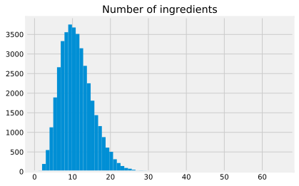
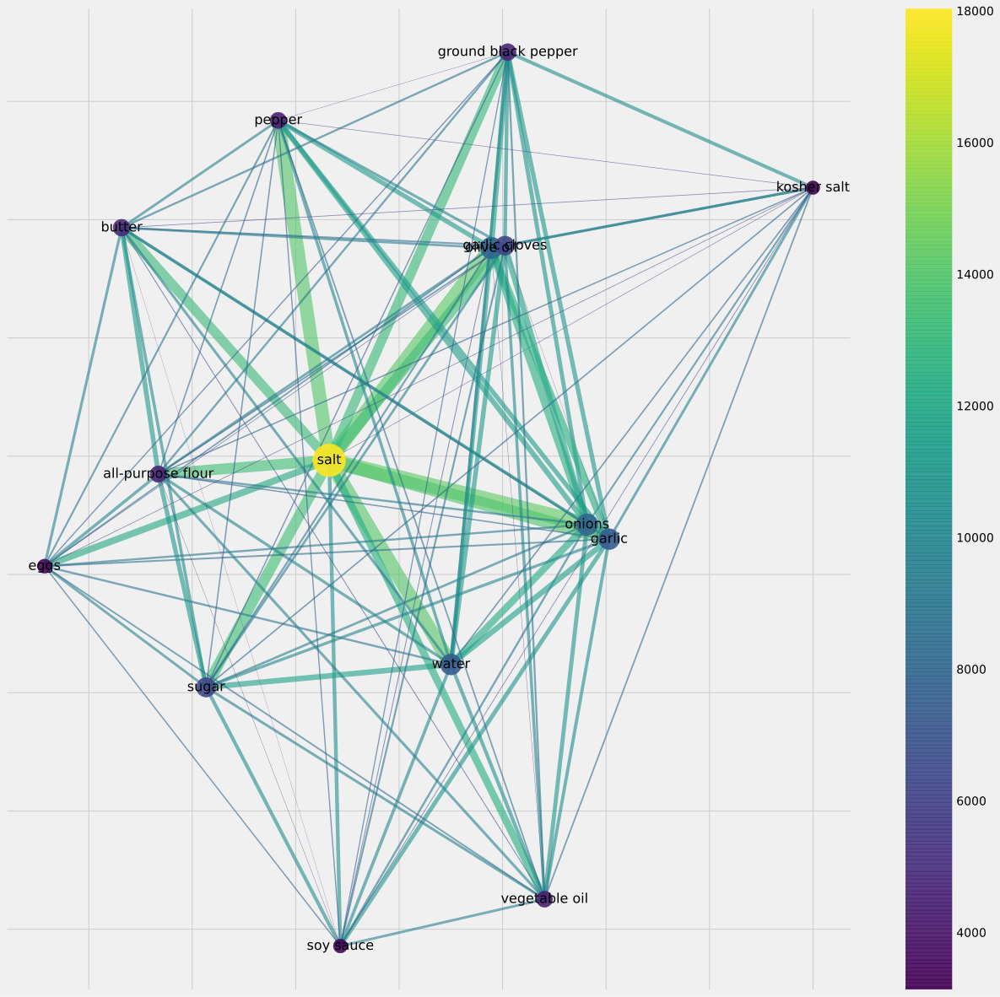

# WhatsCooking / yummyly.com
## Short Summary

**Number of Recipes:** 39774

**Source:** https://www.kaggle.com/c/whats-cooking/data


**Format:** JSON

**Level of Tokenization:** Ingredients w/o instructions.

## Analysis


### Ingredients





    Median number of ingredients: 10.0
    Std. deviation of number of ingredients: 4.43


The median number of ingredients is 10, which seems plausible. However, the majority has 4-15 ingredients.


As one can see, olive oil is the most prominent ingredient. There seems to be no extra stop words, that need extra removal.


### TOP 15 Ingredients network

We want to evaluate the cooccurances of the 15 most common ingredients in the recipes to gain insight into the components of recipes.





The plot shows that some ingredients co-occur quite often: salt and pepper, or sugar and salt for example. There are variants of salts: non kosher and kosher, and they do occur in the same recipes not often and partition the graph.

Idea compare different cuisines, that are given in the dataset.

## Sample recipe from the dataset 

```
id: 32304

cuisine: mexican

ingredients: ['cooked chicken', 'enchilada sauce', 'sliced green onions', 'picante sauce', 'green pepper', 'corn tortillas', 'canned black beans', 'shredded lettuce', 'sour cream', 'shredded cheddar cheese', 'garlic cloves', 'canola oil']
```

Only ingredients, even without amounts or units, are in this dataset, no instructions. However, the affiliation to a cultural cuisine is given. That's why at the moment it is not considered by us, because of missing instructions. It might be used later, if cuisine is extrapolated.

[Back to README.md](../README.md)
