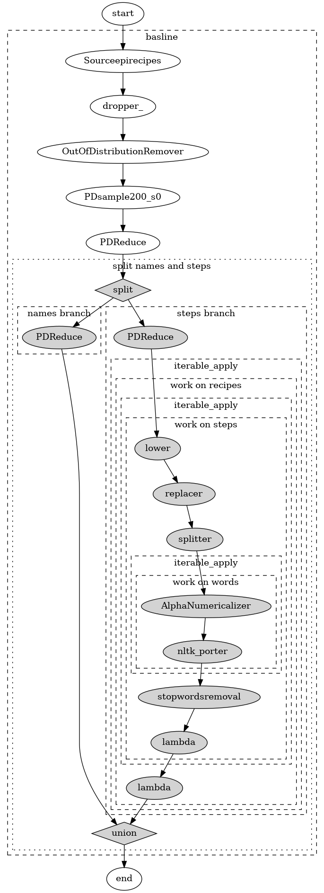
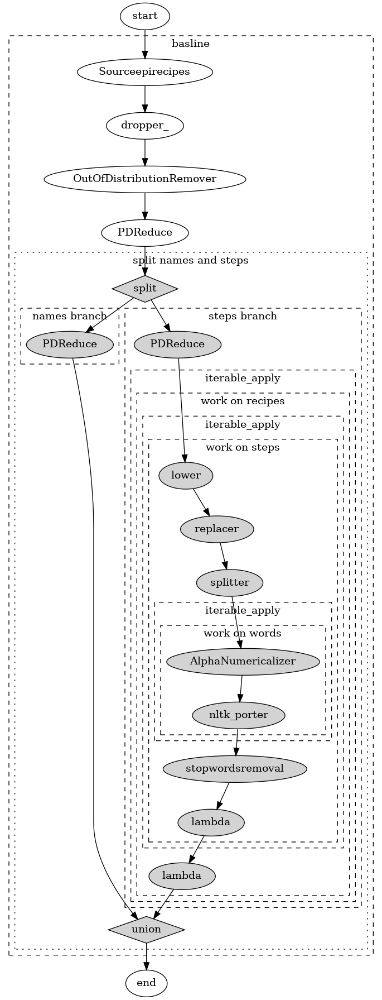
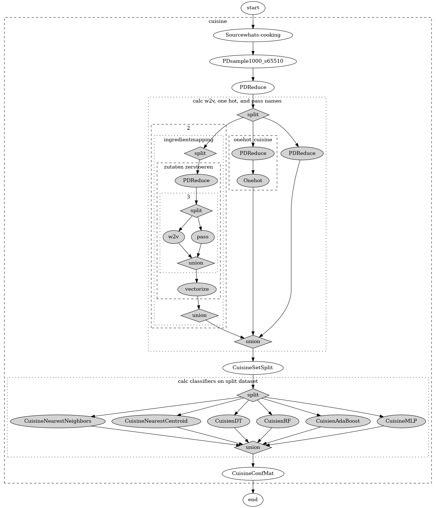
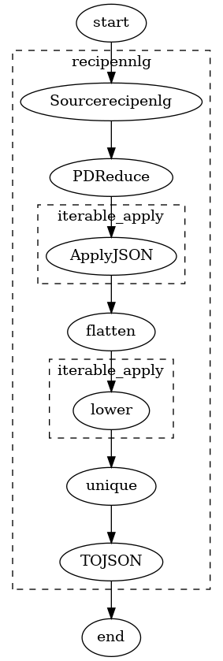
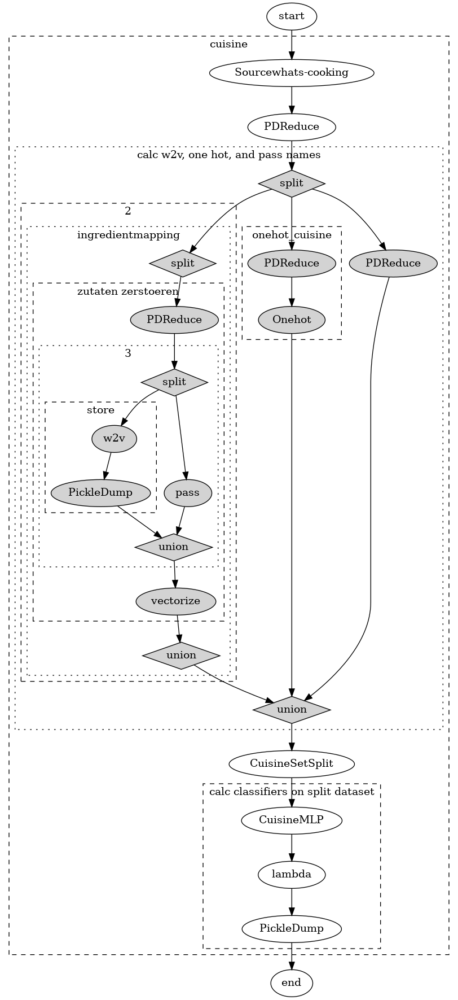
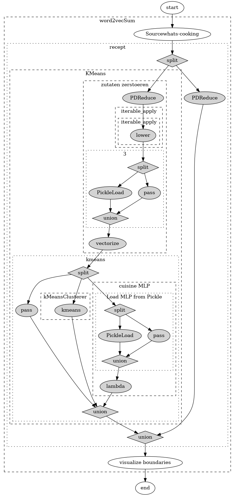
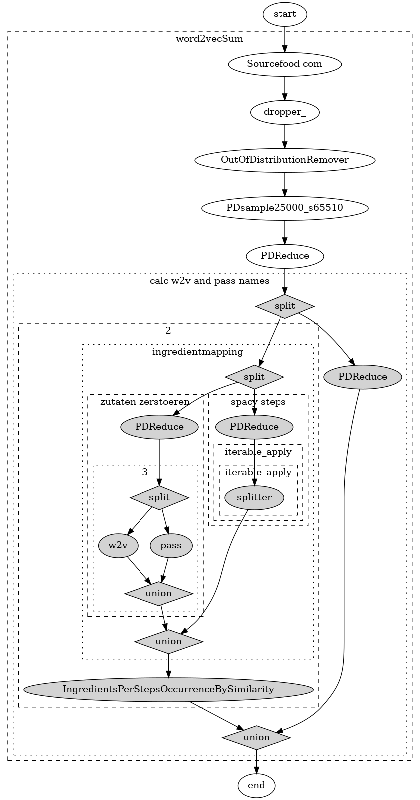

# Clustering recipes

> A recipe has no soul you as the cook must bring soul to the recipe. ***Thomas Keller***

Cooking is an everday activity - especially during a lockdown. The knowledge of cooking is gathered in form of recipes, which is a textual representation either on paper or online. As you might know from personal experience we get recipe snippets from friends or grandma, tear them out of magazines or print them from the web. This often results in a chaotic pile of recipes. Ideally, we would like to have a structured recipe collection where recipes are grouped into sections. By applying clustering methods on recipes we can obtain a structured collection. Because we found this to be an interesting problem without any previous research, we chose the following as the task for our project: To find a meaningful clustering for a given set of recipes.
But what is a meaningful clustering? You can for example cluster by cuisine, like Asian or Mexican, or by meal type like pastries, drink, stews and others and use them as section titles.
## installation guideline


### Installing python requirements

```sh
pip3 install -r requirements.txt
```

If you have not used stopwords from nltk before, please follow the following instructions:

Please use the NLTK Downloader to obtain the resource:
```
  >>> import nltk
  >>> nltk.download('stopwords')
```
### datasets

Please obtain the datasets from the various sources listed in [Milestone 1](../milestone-1/README.md). The structure of the folder `datasets` is the following:

```
datasets
├── eightportions
│   ├── LICENSE
│   ├── recipes_raw_nosource_ar.json
│   ├── recipes_raw_nosource_epi.json
│   └── recipes_raw_nosource_fn.json
├── epirecipes
│   ├── epi_r.csv
│   ├── full_format_recipes.json
│   ├── recipe.py
│   └── utils.py
├── food-com
│   ├── ingr_map.pkl
│   ├── interactions_test.csv
│   ├── interactions_train.csv
│   ├── interactions_validation.csv
│   ├── PP_recipes.csv
│   ├── PP_users.csv
│   ├── RAW_interactions.csv
│   └── RAW_recipes.csv
├── recipe1m
│   ├── layer1.json
│   └── recipes_with_nutritional_info.json
├── recipenlg
│   └── full_dataset.csv
└── whats-cooking
    └── train.json
```

**Note:** You do not have to supply all datasets.

#### IMPORTANT!
Please export the folder using `export RECIPE_DATASET_PATH=<path-to-dataset>`

## Predefined Pipelines

If not stated differently simply call them by `python3 <filename.py>`. Do not forget to export the `RECIPE_DATASET_PATH` beforehand.

### `baseline_approach.py`

**Aim:** Use TFIDF on the steps/instructions to cluster recipes, under the assumption that all ingredients are listed in the steps. 
Uses a hierarchical clustering algorithm (not part of the pipeline).

**Design:**



### `clustering_algorithms.py`

**Aim:** Applying different clustering algorithms to TFIDF-baseline approach. Qualitative evaluation by hand (hovering over some).

**Design:**



### `cuisine_w2v.py`

**Aim:** Learn to predict cuisine labels on whatscooking dataset. Calculating accuracy on test dataset.

**Design:**



### `ingredients_crawler.py`

**Aim:** Retrieve all ingredients from recipenlg, uniquenize them and store them in file.

**Design:**


### `tfidf-pca-kmean-interactive-plot.py`

**Aim:** Use tfidf in combination with pca and kmeans and offer an interactive plot possibility (hovering over recipes is possible).
**Design:**

Following shows only the preprocessing pipeline:

### `versus_plot.py`

**Aim:**  In this experiment we want to explore whether the kMeans-Clustering and
the MLP ansatz are doing similiar things.

**Output:** k-Means clusters are marked by shape, MLP cuisine labels by color.

**Execution:**

1. Run the `python3 versus_plot.py train` pipeline.
2. Run the `python3 versus_plot.py test` pipeline.

**Design:**
For the train pipeline:


For the test pipeline:



### `w2v_hierachical.py`

**Aim:**  Cluster using our w2v approach and hierachical clustering.

**Design:**



## Pipeline Design: Writing your own Pipeline

### Writing own PipelineStep(s)
Our approach to writing Pipeline is by deriving all steps from a `PipelineStep` class.

All initalization is done in the constructor, the actual processing should be take place in `process`.

The signature of process is the following:

```
data, head = step.process(data,head)
```

head is of type `Head` and is used to store infos about the processed data, this could be later used for caching
(use `head.addInfo()`).

#### Bonus visualisation:

Overwriting the `visualize` method allows to customize the graphviz visualization. To change the pointing 
nodes overwrite `begin_viz` and `end_viz` (only returns a simple string).

## Tests

We supply tests for all deterministic PipelineSteps we have implemented. Run them by:

```sh
pytest
```